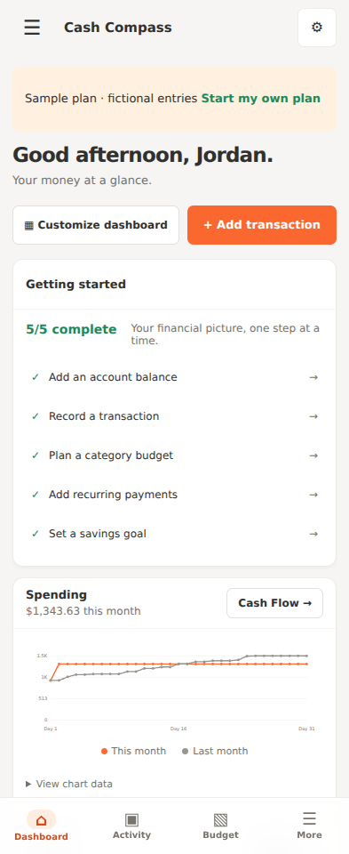
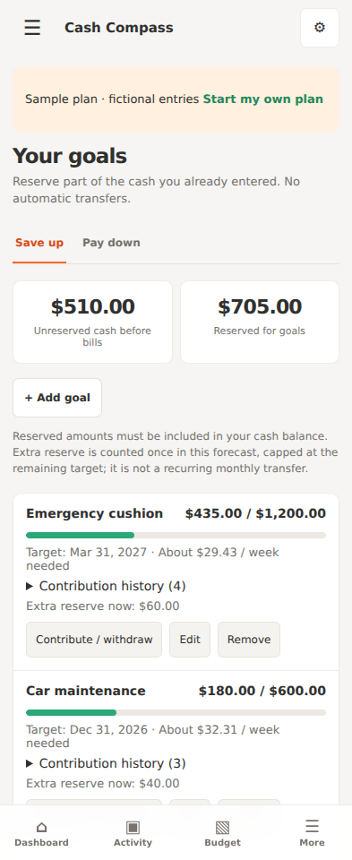
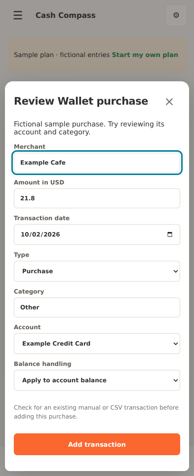
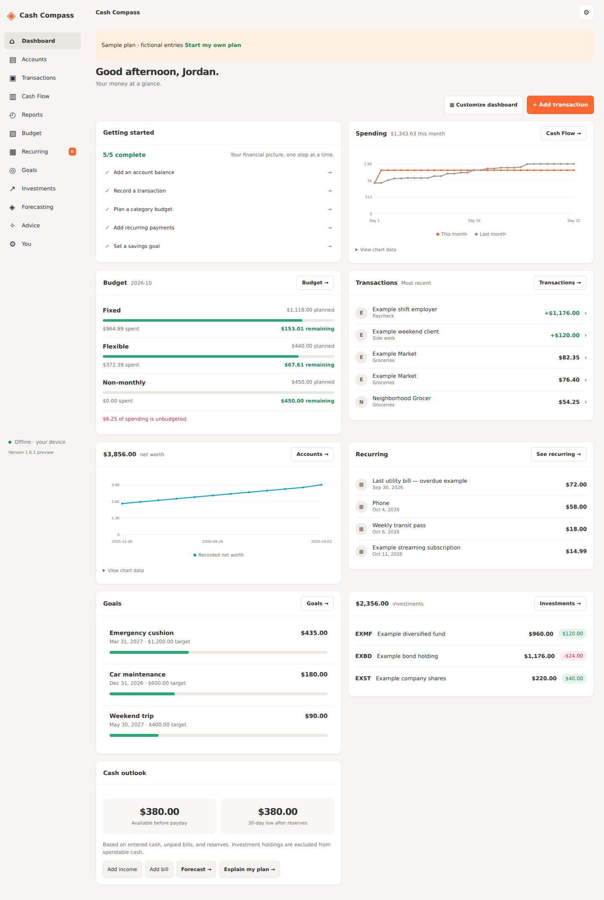
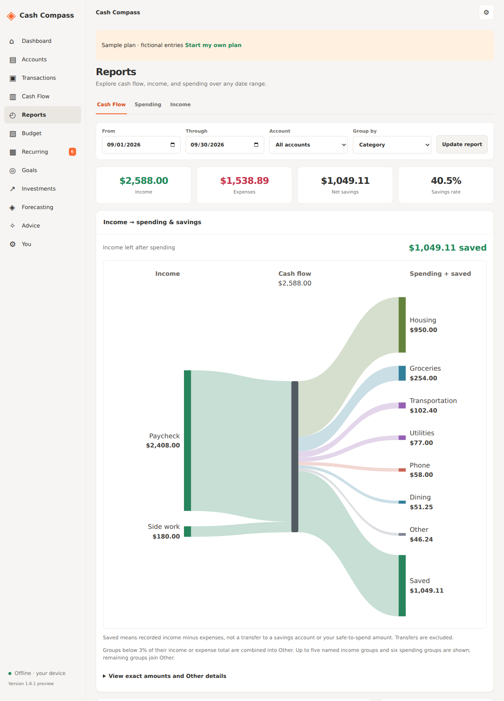

# Cash Compass for Android

An offline cash-flow planner for hourly and irregular income.

## Download and install

Open [Releases](https://github.com/Bobbywasabi31/cash-compass-android/releases) and download **Cash-Compass-1.28.0-preview.apk** from the newest successful preview. On your Android phone, tap the downloaded APK, allow your browser to install it when asked, and tap Install. Android 7.0 or newer is supported.

This is a debug-signed testing preview. Copy a backup from **You → Backup / restore** before uninstalling or changing preview builds. Preview builds currently use different debug signing certificates, so installing a later preview can require uninstalling the old one. Production signing and Play Store publishing are not configured.

## New in 1.28.0: Loan amortization and cost basis lots

- **Loan amortization tracker** (roadmap #51): Plan → Loan amortization shows payoff schedule, total interest, and how extra monthly payments save interest and time.
- **Holdings cost basis and gain/loss** (roadmap #52): Investments → Lots tracks purchase lots per holding with weighted average cost. Unrealized gain/loss already shown from entered prices.

## New in 1.27.0: Goal auto-allocation and net worth milestones

- **Savings goal auto-allocation** (roadmap #49): each goal now shows the per-paycheck contribution needed to hit its deadline, and whether you're on track based on your current monthly reserve.
- **Net worth milestones** (roadmap #50): Goals → Net worth milestones tracks targets with progress bars and projected dates based on your recent savings rate.

## New in 1.26.0: Debt payoff planner and sinking funds

- **Debt payoff planner** (roadmap #45): Plan → Debt payoff planner compares snowball (smallest balance first) vs avalanche (highest rate first) with payoff time, payoff date, and total interest. Add debts with balance, APR, and minimum payment.
- **Sinking funds** (roadmap #48): Plan → Sinking funds spreads annual/irregular expenses into monthly set-asides. Set a target, due date, and saved amount; see monthly needed and progress.

## New in 1.25.0: Undo for bulk edits and budget moves

- **Undo for bulk edits and deletes** (roadmap #42): bulk category changes and the new bulk delete offer a 60-second undo. An Undo button appears in Transactions after the operation.
- **Move money between budget categories** (roadmap #44): Budgets → Move reallocates planned amounts mid-month (e.g., $100 from Food to Transport). A Budget moves history table shows every reallocation.

## New in 1.24.0: CSV + notification merge/reconcile

- **CSV + notification merge/reconcile** (roadmap #4): when importing CSV, rows are matched against the notification inbox by amount, then date within ±3 days, then fuzzy merchant. Matched rows merge (CSV wins on amount/name; your existing category preserved). Unmatched rows go to the inbox as "missed by notifications" for review. The preview shows match/miss counts.

## New in 1.23.0: Proactive insights and monthly review

- **Proactive insights feed** (roadmap #77): the Home dashboard now shows insight cards derived from your data — spending spikes (e.g., "Dining is 40% over last month"), budget pressure at 80%/100%, bills due this week, runway warnings, and savings-rate trends.
- **Auto-drafted monthly review** (roadmap #80): Reports → Monthly review drafts a "what changed this month" summary — which categories rose or fell, savings-rate comparison, and scheduled bills.

## New in 1.22.0: Spending trends and month-over-month insights

- **Spending trends** (roadmap #59): Reports → Spending trends shows per-category totals for each of the last 12 months, with your top 8 categories and monthly totals.
- **Month-over-month insights** (roadmap #60): Reports → Month over month explains where spending rose or fell versus last month, ranked by dollar change with percentages.

## New in 1.21.0: Top merchants and savings rate

- **Top merchants** (roadmap #63): Reports → Top merchants ranks spending by merchant over the last 3, 6, or 12 months, with share bars and transaction counts. Merchant names are normalized (e.g., "CHIPOTLE #123" groups with "Chipotle").
- **Savings rate** (roadmap #68): Reports → Savings rate shows percent of income saved per month over the last 12 months, with overall rate and trend direction.

## New in 1.20.0: Overtime, holiday pay, and gig income variability

- **Overtime and holiday pay:** the paycheck estimator now accepts overtime hours (paid at 1.5×) and holiday hours (paid at 2×), with a per-component breakdown and take-home total that can be added as planned income.
- **Gig income variability:** Plan → Gig income variability shows your worst/best recorded months, average, and a 0–100 consistency score (100 = perfectly steady).

## New in 1.19.0: Income streams and per-bill reminders

- **Multiple income streams** (roadmap #19): income entries now track optional hours and hourly rate per stream. Plan → Income streams groups expected income by source over the next 12 months, with paydays, next payday, and per-stream plus combined monthly equivalents.
- **Per-bill reminder settings** (roadmap #27): each bill now has its own phone-reminder toggle and days-ahead setting (0–60, default 3). The Android reminder check honors each bill's window; bills with reminders off are skipped.

## New in 1.18.0: Pay-period budgets and budget alerts

- **Pay-period budgets** (roadmap #14): Budget now has Weekly and Bi-weekly tabs that slice your monthly budgets into 52/26 periods (weeks start Monday). Unspent amounts roll forward into the current period for categories that allow rollover.
- **Budget alerts** (roadmap #20): a Budget alerts card warns when a category reaches 80% of its available budget and flags it when it's over 100%, with refunds netted the same way as the budget summary.

## New in 1.17.0: Income smoothing and paycheck estimator

- **Income smoothing** (roadmap #15): pick a steady target paycheck in Plan and see, from your recorded months, how much to reserve in high months and draw in lean months — with a month-by-month table and running smoothing balance.
- **Hours and paycheck estimator** (roadmap #16): enter expected hours to estimate gross, tax, and take-home from your hourly rate and deduction rate, then add the take-home straight into Plan as expected income.

## New in 1.16.0: Automatic backups and data-loss guards

- **Automatic backups** (roadmap #6): your plan is now backed up automatically — before every restore, reset, or sample-data load, plus once daily. The last 5 are kept in You → Automatic backups with one-tap restore.
- **Data-loss guards** (roadmap #9): destructive actions now say exactly what happens and confirm that an automatic backup was saved first. Restoring an automatic backup backs up your current plan before replacing it, so nothing is ever lost.

## New in 1.15.0: Transfer auto-detect and tax set-aside

- **Auto-detect transfers on import** (roadmap #32): the CSV preview now spots expense/income row pairs for the same amount across different accounts within 3 days and offers to import each pair as a single transfer instead of two transactions — no more double-counted moves between your accounts.
- **Tax set-aside tracker** (roadmap #23): tick “Untaxed income” on freelance/gig payments. Reports → Tax set-aside shows this year's untaxed income, what you should have set aside at your rate (adjustable, default 25%), what's reserved via tax reserves, and what's still missing — plus the next quarterly estimated-tax deadline, with an optional reminder notice on your home tab.

## New in 1.14.0: Emergency fund and reimbursable tracking

- **Emergency fund tracker** (roadmap #25): a new section beside the low-season runway shows how many months of essential spending your spendable cash covers, with a progress bar toward your target (default 3 months) and the amount still needed to get there. It draws on the same cash pool as the runway and shares its essential-spending figure.
- **Reimbursable tracking** (roadmap #37): tick “Reimbursable” on any expense you expect to be paid back. Activity → “Reimbursements” shows the total, what’s been paid back, and what’s still owed, with per-expense logging (partial paybacks supported). Logging is pure tracking — record the actual deposit as income separately.

## New in 1.13.1: Critical save fix

- **Fixed:** restored the `syncReminders()` function lost in the 1.11.0 edit. Without it, every save threw an error after writing data — the dialog stayed open and follow-on actions (like enabling wallet capture) never ran. All saves now complete cleanly.

## New in 1.13.0: Rules engine and refund linking

- **Rules engine** (roadmap #30): Activity → “Rules” — create “if the merchant name contains X, set category or add tag Y” automations. Rules run top to bottom on new transactions: the first match sets the category when none is set, and every match adds its tag. Each rule shows a live match count with an “Apply to existing” button to recategorize past transactions.
- **Refund linking** (roadmap #36): income transactions can now link to the original purchase via “Refund for purchase.” Linked refunds net against the original's category in budgets, spending reports, and summaries — so a $100 purchase with a $40 refund shows as $60 of spending, not $100 of spending plus $40 of income.

## New in 1.12.0: Split transactions and duplicate cleanup

- **Split transactions** (roadmap #28): open any transaction and choose “Split across categories.” Divide one purchase into up to 10 parts with their own categories; the parts must add up to the original to the cent, and cash adjustments carry over automatically. Tags and notes stay on the first part.
- **Duplicate cleanup** (roadmap #33): Activity → “Find duplicates” lists transactions that match on date, merchant, amount, type, and accounts, and merges true double-records into one — combining tags and keeping the longest note. A warning reminds you that two legitimate same-day purchases can look identical.

## New in 1.11.0: Tags, notes, and saved views

- **Tags and notes** (roadmap #29): every transaction can now carry up to 10 free-form tags and a note. Tags show as chips on each row and are searchable.
- **Advanced search and saved filters** (roadmap #34): the Activity tab filters by tag and amount range (min/max) in addition to everything before. Save any filter combination as a named one-tap view, apply or delete views anytime.

## New in 1.10.0: Low-season runway and forecast range

- **Low-season runway** (roadmap #13): the Plan tab now shows how many weeks/months your spendable cash lasts if income drops. Drag the "what if income drops to $X" slider, set monthly essential spending (defaults to your recent average), and see the runway instantly.
- **Forecast range** (roadmap #66): best/expected/worst 30-day ending cash derived from your actual income variability — what if the next 30 days earn like your worst or best recorded month instead of the plan.

## New in 1.9.0: Variable bill estimates and merchant name cleanup

- **Variable bill estimates** (roadmap #26): bills like utilities can now learn from your history. Tick "Estimate from my recent history" on any bill and the forecast uses the average of your last 3 recorded payments for that merchant, marked with ~ wherever it appears.
- **Merchant name cleanup** (roadmap #31): processor noise such as "SQ *", "TST*", and trailing store numbers is stripped automatically, so the same merchant always matches — better memory suggestions, cleaner subscription detection, and more accurate bill estimates.

## New in 1.8.0: Late-paycheck scenario and subscription detector

- **Late-paycheck scenario** (roadmap #18): the Plan tab's "What if pay changes?" section now models payday slipping N days late — see which bills fall before the delayed paycheck, how deep the trough gets, and the new per-day safe amount.
- **Subscription detector** (roadmap #22): Reports now finds charges repeating weekly, biweekly, monthly, or yearly in your last 12 months of expenses, flags price increases, and adds any of them as a bill with one tap.

## New in 1.7.0: Cash-crunch warnings and merchant memory

- **Cash-crunch warnings:** set an everyday safety buffer in You and the 30-day forecast flags dates where projected cash dips below it.
- **Merchant memory:** merchants you use are remembered with their category and account; the transaction form pre-fills them as you type. Clear it any time in You → Your data.

## New in 1.6.1: Complete sample plan

Choose **You → Load sample plan** and confirm replacement to explore Jordan's fictional finances. Back up any plan you want to keep first. The sample includes four account types, twelve months of transaction and net-worth examples, transfers and card payments, income and expense budgets with overspending and rollover, recurring paychecks and bills, an overdue bill, three goals with contributions and withdrawals, three manually priced holdings, and long-term scenarios with life events.

Every main section is populated, including Cash Flow and its Sankey diagram. Dates are based on when the sample is loaded; completed example transactions never fall after that date. The current month's dates are capped at today so it is useful even at the start of a month. History is fictional and already included in the sample's account balances. Investment names, symbols, prices, and growth assumptions are examples.

The Wallet page includes two clearly labeled fictional review notices and an example recorded purchase. Capture stays paused while using the sample, and phone reminders start off. Try editing, reviewing, exporting, backing up, and restoring the sample. **Start my own plan** clears the examples after confirmation; loading an app update does not replace an existing plan automatically.

## Screenshots

Cash Compass 1.6.1 with Jordan's complete fictional sample loaded. These are browser captures of the interface bundled in the Android app, showing phone and wider layouts. Select an image for full size, or open the [full nine-screenshot gallery](docs/screenshots/README.md) for accounts, budgets, investments, and forecasting too.

| Phone dashboard | Savings goals | Wallet purchase review |
| --- | --- | --- |
| <a href="docs/screenshots/dashboard-phone.png"></a> | <a href="docs/screenshots/goals-phone.png"></a> | <a href="docs/screenshots/wallet-review-phone.png"></a> |

| Complete dashboard | Cash-flow Sankey |
| --- | --- |
| <a href="docs/screenshots/dashboard-desktop.png"></a> | <a href="docs/screenshots/cash-flow-desktop.png"></a> |

## New in 1.6: Sankey cash-flow diagram

Open **Cash Flow** for a monthly, quarterly, or annual diagram, or **Reports → Cash Flow** for a custom date range. Account and category/merchant filters apply to the diagram and its exact-value tables.

Proportional bands show recorded income flowing into spending groups and **Saved** (income minus expenses). When expenses exceed income, a **Funding gap** balances the diagram without assuming borrowing or another funding source. Empty and transfer-only periods show an empty state; transfers never count as income or spending. Saved is not an account balance, goal contribution, or safe-to-spend estimate.

Groups below 3% of their side's total are combined into **Other**. The diagram shows up to five named income groups and six named expense groups; additional groups also join Other. An existing Other category joins the same bucket. Open **View exact amounts and Other details** to see every included group and cent. On phones, swipe the chart horizontally or use the stacked tables. This is a read-only view of recorded transactions; no new permissions, data collection, or backup schema changes.

## New in 1.5: Google Wallet purchase import

Open **You → Google Wallet purchase import**, choose the account and balance handling, and save. Then open Android notification access and enable **Cash Compass · Wallet purchases**. Access is off by default and must be granted by you. Android may show a restricted-settings prompt for sideloaded previews; see [Android's explanation](https://support.google.com/android/answer/12623953).

New Google Wallet notices are captured on-device while the app is closed and imported the next time it opens. Clear English USD purchases insert automatically; dollar signs mean USD. Review mode lets you approve every purchase instead. Choose review mode when using multiple cards. All automatic imports use the selected account and start in Other. Edit them normally afterward.

Repeated notifications are deduplicated; updates and possible manual/CSV duplicates go to review. Failed payments, refunds, pending charges, unsupported currencies, and ambiguous text never insert automatically. Dismiss an already recorded notice or review its details. This is notification parsing, not a bank or Wallet API, and formats vary by phone. Only future notifications are captured; there is no historical Wallet import.

The app does not have internet permission. Android grants broad notification access; the service discards other sources before retaining text. It accepts Google Wallet's package or Google Play services only with an explicit Google Wallet/Google Pay attribution. Pause stops capture; revoke access in Android to fully disconnect. See [privacy](PRIVACY.md) for retention and backup behavior.

## New in 1.4

A responsive workspace inspired by the supplied desktop references: customizable dashboard, grouped accounts and recorded net-worth history, transaction filters and bulk categories, cash-flow diagrams and period reports, income/expense budgets, recurring list/calendar, savings/debt tabs, manual investment holdings, and editable long-term scenarios. Phone layouts use a navigation drawer and bottom tabs; larger windows use a sidebar.

Holdings use entered prices and are separate from cash. History starts with saved observations; it is not backfilled. Forecast growth is a user assumption, not a market prediction. Screenshot balances and personal records are not bundled with the app.

## What works

- Track checking, savings, cash, and credit cards; reconcile balances and record transfers.
- View monthly category reports and six-month income/expense comparisons.
- Set savings deadlines and log contributions or withdrawals.
- Preview CSV imports with duplicate detection, and export transactions with Android’s file picker.
- Enable optional daily Android bill reminders from You.
- Record, search, edit, and delete categorized transactions with reversible cash adjustments.
- Repeat bills and paychecks weekly, biweekly, monthly, or yearly; browse the payment calendar.
- Budget by fixed, flexible, or occasional categories with optional rollover.
- Enter and edit cash, expected gross or take-home income, unpaid bills, reserves, and goals.
- See estimated available spending through payday and a separate 30-day cash forecast.
- Keep overdue bills visible; confirm received income and paid bills with balance reconciliation.
- Model fewer hours without altering current cash.
- Ask the offline, rules-based coach about the entered forecast.
- Copy and restore a local JSON backup. Sample data is optional.

The coach is not yet a connected AI model. Optional phone reminders run around 9 AM for bills due within three days or overdue; Android battery saving may delay them. Amounts are USD. No account or bank credentials are required. See [privacy](PRIVACY.md) and [release notes](RELEASE_NOTES.md).

## Calculation rules

The forecast starts with the sum of tracked account balances, including negative card debt. This is a net balance, not a guarantee that funds are liquid in a particular account. Transfers change account balances but never count as income or spending. Current cash includes the money reserved for goals, taxes, and the safety buffer. Estimated spending through payday subtracts those reserves and all unpaid bills dated on or before payday, including overdue bills. Without a next payday, no safe-to-spend figure is shown. Daily amounts round down to cents.

The 30-day timeline deducts bills before income on the same date. Late income is excluded until received or rescheduled. Gross income uses the user's tax percentage; take-home income is not taxed again. Goal extra reserves apply once per forecast and are capped at the remaining goal target. Goal progress and extra reserves are planning amounts; no transfers occur. Fewer-hours scenarios reduce the next expected payment (capped at that payment), not cash already available. Actual spending, payment delays, and missing bills must be reflected manually.

## Build and verify

The [Android workflow](.github/workflows/android.yml) uses JDK 17, Gradle 8.7, Android Gradle Plugin 8.6.1, SDK 35, and build tools 34.0.0. It runs forecast tests, Android lint, an Android 15 emulator smoke test, and signature verification before publishing an APK and SHA-256 checksum. Instrumentation test dependencies are used only in tests; the app has no external runtime libraries.

For local builds install those tools, set ANDROID_HOME, then run:

```sh
node --test tests/*.test.cjs
gradle :app:assembleDebug :app:lintDebug
# With an emulator or device connected:
gradle :app:connectedDebugAndroidTest
```

APK: `app/build/outputs/apk/debug/app-debug.apk`.
Open the project with an Android Studio version supporting AGP 8.6.1, or use the pinned Gradle installation above. A Gradle wrapper is not committed; CI supplies Gradle explicitly.

## Source

- `core.js`: pure date, cent-based cash, reservation, migration, and settlement logic.
- `app.js` / `app.css`: interface, validated local persistence, and coaching explanations.
- `MainActivity.java`: restricted local-asset WebView, Android back handling, and system insets.
- `tests/core.test.cjs` and `AppSmokeTest.java`: forecast regressions and installed-app smoke test.

See [REVIEW.md](REVIEW.md) for findings, fixes, and verification boundaries.
