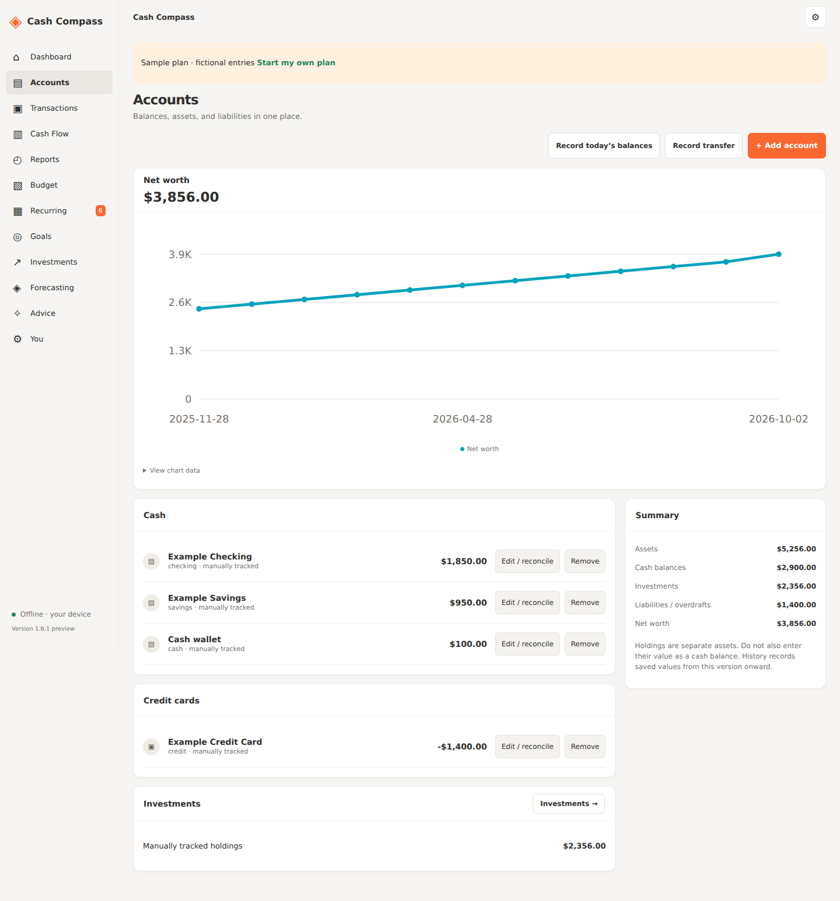
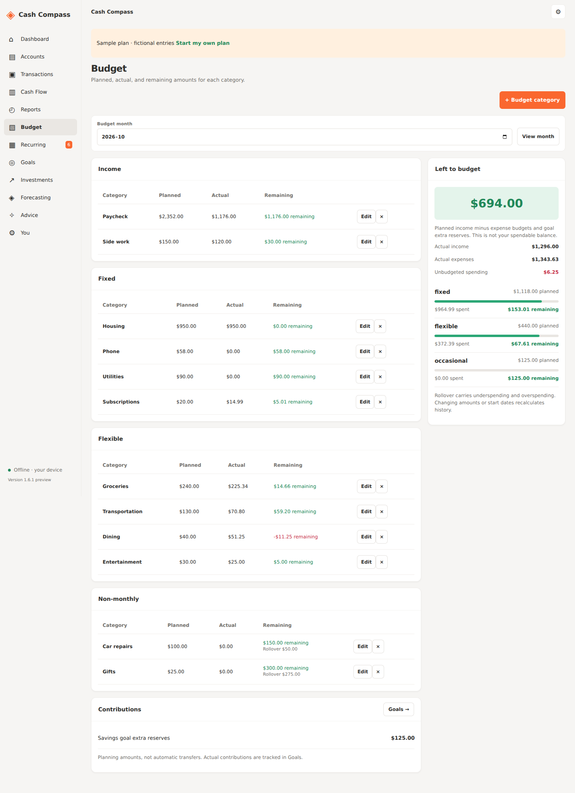
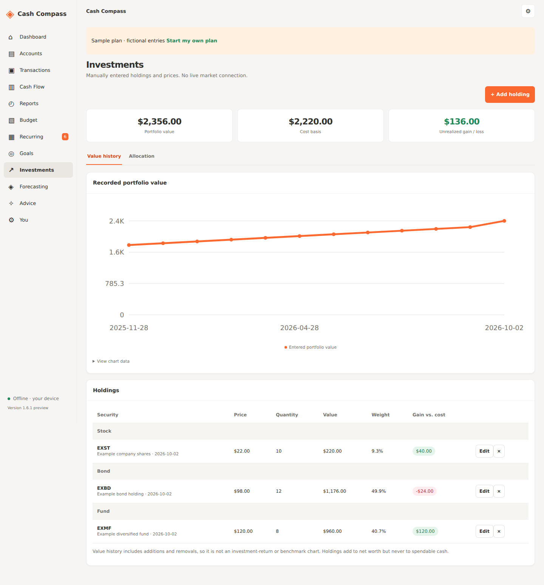
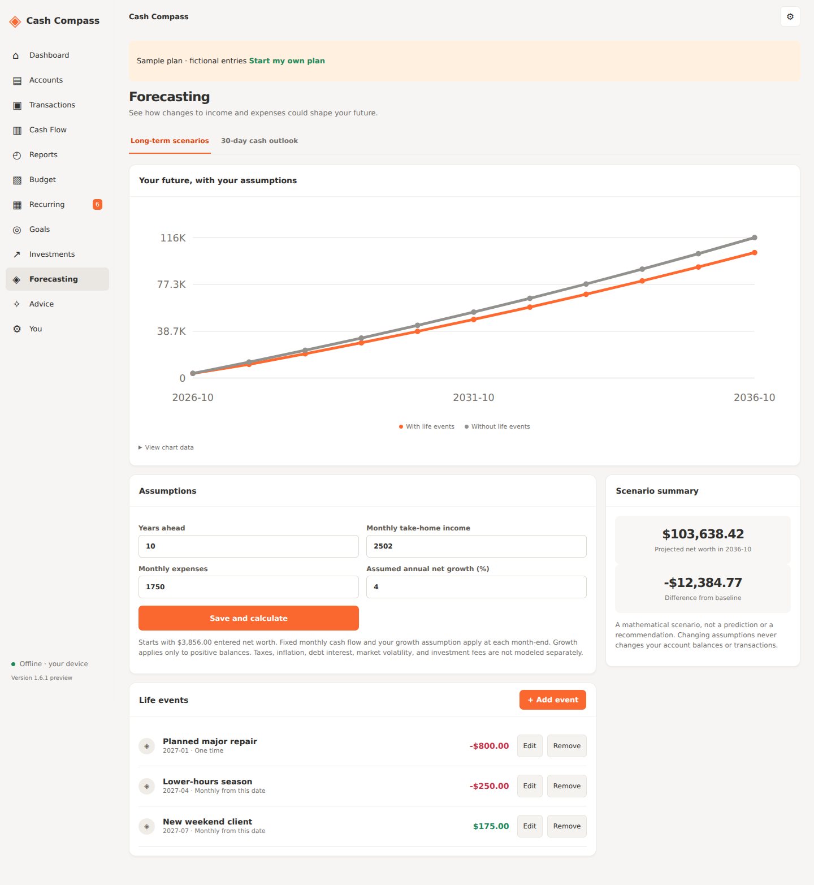

# Sample interface gallery

OddDough **1.6.1**, running with Jordan's complete fictional sample plan. These PNGs are browser captures of the same bundled interface used by the Android WebView. They show responsive phone and wider window layouts.

The sample was loaded through **Load sample plan → Confirm** using **2026-10-02** as the capture date. Its dates move with the day you load it. All balances, merchants, holdings, history, and projections are examples. Navigation, report filters, and opening Wallet review did not change the sample's transactions or account balances.

## Phone layouts

Phone captures use a **393 × 960** viewport. The dashboard and goals show the app's bottom navigation; Wallet review opens as a dialog.

| Dashboard | Savings goals | Wallet purchase review |
| --- | --- | --- |
|  |  |  |

The Wallet example is open for review before adding its **$21.80** purchase. The sample keeps notification capture paused. The review form lets you check the merchant, amount, date, category, account, and balance handling.

## Complete dashboard

All nine dashboard cards have sample content: setup, spending, budget, recent transactions, net worth, recurring bills, goals, investments, and cash outlook.

## Accounts and net worth

Checking, savings, cash, and a credit card appear alongside twelve fictional net-worth observations. The account summary separates cash, investments, and liabilities.

## Income and expense budgets

Planned and actual amounts cover income, fixed, flexible, and non-monthly categories. Dining is **$11.25 over budget**; car repairs and gifts show carried balances.

## Cash-flow Sankey

In **Reports → Cash Flow**, select **2026-09-01 through 2026-09-30**, all accounts, grouped by category. The previous complete sample month has **$2,588.00 income**, **$1,538.89 expenses**, and **$1,049.11 saved**. Transfers are excluded.

## Manual investments

The three fictional holdings include a stock, a bond, and a fund, with entered prices, allocation weights, gains and losses, and twelve value observations. Total sample portfolio value is **$2,356.00**.

## Long-term scenarios

The sample's assumptions and three life events produce separate curves with and without those events. The repair, lower-hours season, and new client are mathematical examples.

## Capture reference

- Source: [sample-plan commit 391cea6](https://github.com/Bobbywasabi31/cash-compass-android/commit/391cea6dcd94e50d2eaf888b9e0668418c2da30a).
- Interface: [`index.html`, `core.js`, `app.js`, and `app.css`](../../app/src/main/assets/).
- Wider captures use a 1440-pixel viewport and include the full page; the 1200-pixel report capture ends after the complete Sankey panel.
- Captured after loading the sample and waiting for the save notice to disappear. No personal records or external services were used.
- Checked all nine images visually, confirmed no horizontal page overflow at the captured widths, and observed no JavaScript errors during capture.

[Back to the main README](../../README.md#screenshots)
